# Keen - a coding agent CLI | System Architecture RFC

## 1. Overview

This document outlines the system architecture for Keen, a terminal-based coding agent CLI written in Go. The tool provides AI-assisted code editing capabilities with two primary modes: **plan** (suggestions only) and **work** (with permission-based edits).

---

## 2. High-Level Architecture

### 2.1 Component Overview

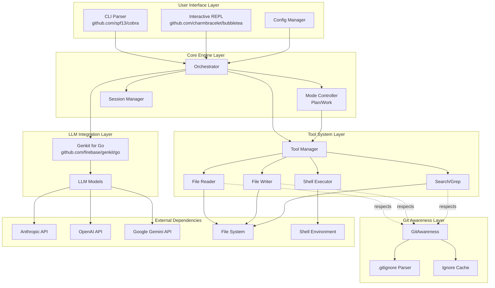

### 2.2 Data Flow

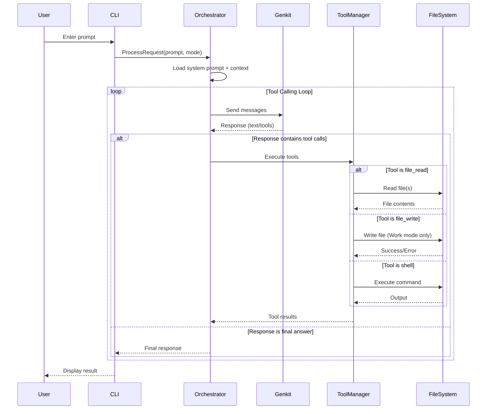

---

## 3. Detailed Component Design

### 3.1 Module Structure

```
keen-cli/
├── cmd/
│   └── agent/
│       └── main.go              # Entry point
├── internal/
│   ├── cli/
│   │   ├── root.go              # Cobra root command
│   │   ├── repl.go              # Interactive REPL command
│   │   └── config.go            # Config commands
│   ├── config/
│   │   ├── config.go            # Config struct and defaults
│   │   └── loader.go            # YAML config loading
│   ├── orchestrator/
│   │   ├── orchestrator.go      # Main orchestration logic
│   │   ├── context.go           # Context/conversation management
│   │   └── mode.go              # Plan/Work mode handling
│   ├── llm/
│   │   ├── client.go            # Genkit client wrapper
│   │   ├── models.go            # Model configuration & factory
│   │   └── message.go           # Message types
│   ├── tools/
│   │   ├── manager.go           # Tool execution manager
│   │   ├── registry.go          # Tool registry
│   │   ├── read_file.go         # File reading tool
│   │   ├── write_file.go        # File writing tool
│   │   ├── edit_file.go         # File editing tool
│   │   ├── shell.go             # Shell execution tool
│   │   ├── grep.go              # Search tool
│   │   └── list_dir.go          # Directory listing tool
│   ├── filesystem/
│   │   ├── guard.go             # Path security guard
│   │   ├── gitawareness.go      # Git ignore handling - CRITICAL
│   │   └── watcher.go           # Optional: file watching
│   └── ui/
│       ├── renderer.go          # Output formatting
│       ├── diff.go              # Diff display
│       └── confirm.go           # User confirmation prompts
├── pkg/
│   └── api/                     # Public API (if needed)
├── configs/
│   └── system_prompts/          # Default system prompts
├── go.mod
├── go.sum
└── README.md
```

### 3.2 Core Interfaces

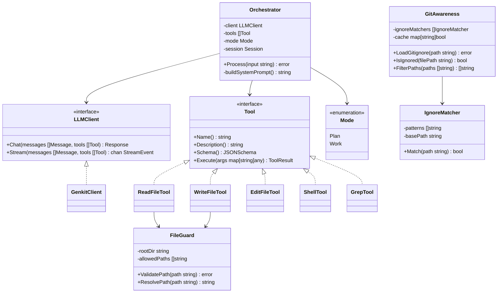

### 3.3 GitAwareness Component

**Purpose:** Prevent wasting tokens and confusing the LLM by filtering out files that should be ignored according to `.gitignore` rules.

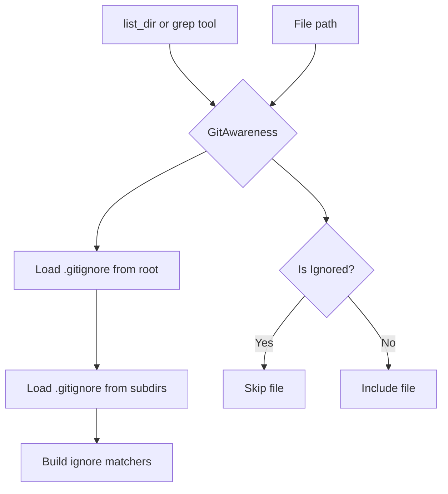

**Example Flow:**
```
User: "explain this codebase"
→ list_dir called on project root
→ GitAwareness loads:
   - .gitignore (node_modules/, *.log, .env)
   - src/.gitignore (*.test.js)
→ Returns filtered list WITHOUT:
   - node_modules/ (saves ~100k+ tokens)
   - .env files (security)
   - build artifacts
```

**Configuration:**
```yaml
filesystem:
  respect_gitignore: true  # Default: true
  additional_ignores:
    - "*.min.js"
    - "dist/"
```

### 3.4 Tool System Detail

The tool system uses a registry pattern for extensibility:

---

## 4. Implementation Steps

### Phase 1: Foundation

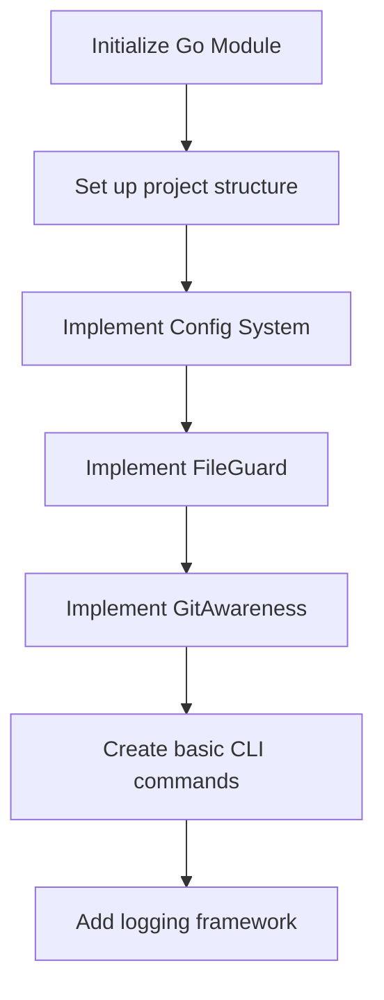

### Phase 2: LLM Integration

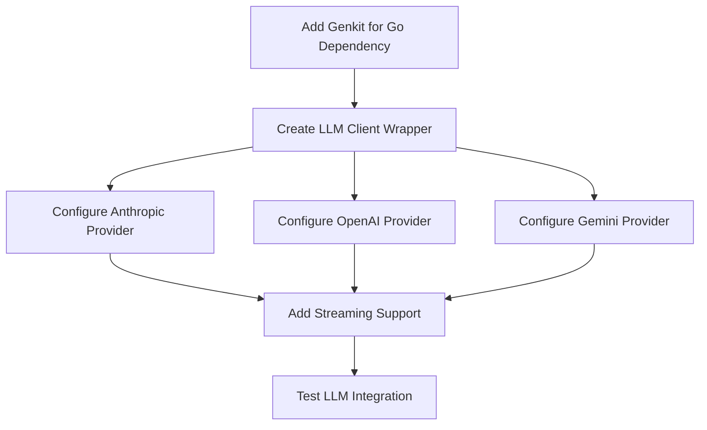

### Phase 3: Tool System

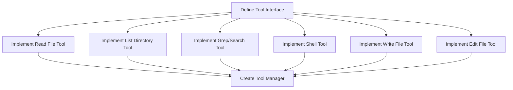

**Tools to implement:**

| Tool | Description | Libraries |
|------|-------------|-----------|
| `read_file` | Read file contents | Standard `os` package |
| `list_dir` | List directory contents | Standard `os` package |
| `grep_search` | Search file contents | `github.com/bmatcuk/doublestar` + std lib |
| `shell` | Execute shell commands | `os/exec` with timeout/sandboxing |
| `write_file` | Write/overwrite files | Standard `os` package |
| `edit_file` | Apply string replacements | Custom implementation |

### Phase 4: Orchestrator & Modes

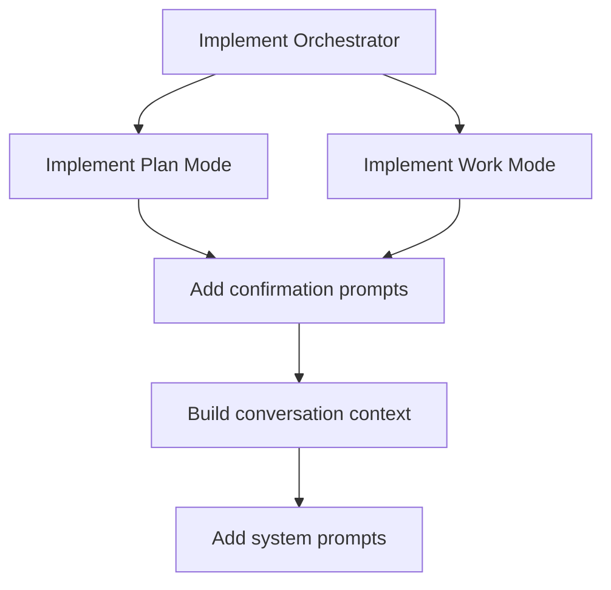

### Phase 5: Interactive UI

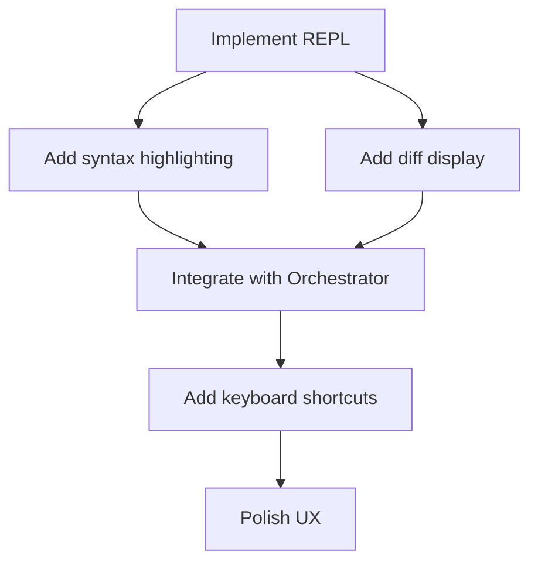

### Phase 6: Testing & Polish

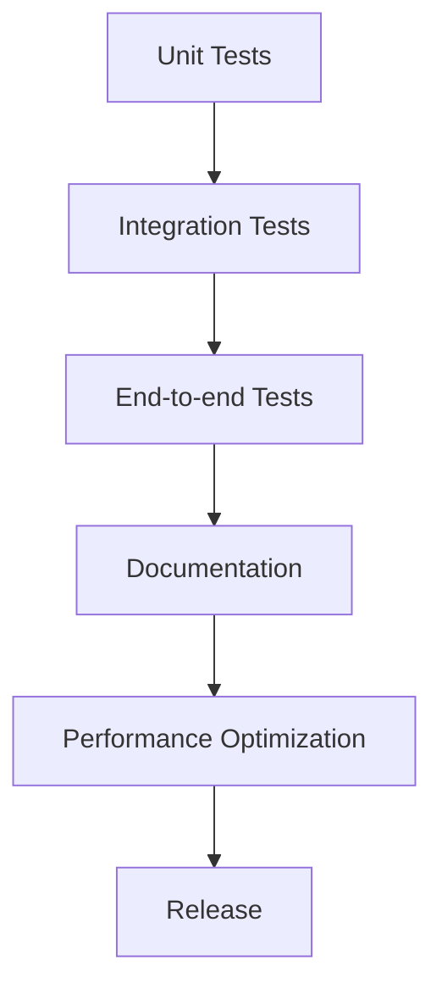

---

## 5. External Dependencies

### 5.1 Required Libraries

| Category | Library | Purpose |
|----------|---------|---------|
| CLI Framework | `github.com/spf13/cobra` | Command-line interface |
| Config Management | `gopkg.in/yaml.v3` | Configuration loading |
| TUI Framework | `github.com/charmbracelet/bubbletea` | Interactive REPL |
| TUI Components | `github.com/charmbracelet/lipgloss` | Styled terminal output |
| User Prompts | `github.com/charmbracelet/huh` | Interactive forms and prompts |
| Syntax Highlighting | `github.com/alecthomas/chroma` | Code display |
| Diff Display | `github.com/sergi/go-diff/diffmatchpatch` | Diff generation |
| LLM Framework | `github.com/firebase/genkit/go` | Unified LLM interface |
| Pattern Matching | `github.com/bmatcuk/doublestar` | Glob patterns |
| Gitignore Parsing | `github.com/go-git/go-git/v5/plumbing/format/gitignore` | Parse .gitignore rules |
| Environment | `github.com/joho/godotenv` | .env file support |

### 5.2 Go Standard Library Usage

- `os`, `os/exec` - File operations and shell execution
- `path/filepath` - Cross-platform path handling
- `context` - Request cancellation and timeouts
- `encoding/json` - JSON marshaling/unmarshaling
- `log/slog` - Structured logging (Go 1.21+)
- `sync` - Concurrency primitives

---

## 6. Security Considerations

### 6.1 File System Security

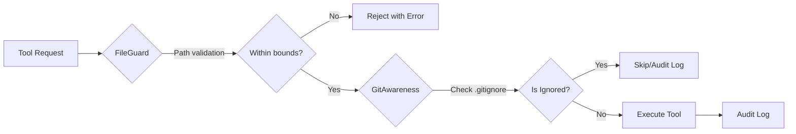

**FileGuard Rules:**
- All paths resolved relative to working directory
- Block access to parent directories (`../`)
- Block access to sensitive paths (`~/.ssh`, `/etc`, etc.)
- Whitelist/blacklist configuration support
- All file operations logged

**GitAwareness Rules:**
- **Respect `.gitignore` by default** (prevents token waste on node_modules, build artifacts)
- Prevent accidental exposure of secrets (`.env` files)
- Cache ignore patterns for performance
- Support nested `.gitignore` files
- Configurable override if needed

### 6.2 Shell Execution Security

- Shell commands run with current user permissions
- Optional command whitelist/blacklist
- Timeout on long-running commands
- Clear user confirmation for destructive commands

### 6.3 API Key Security

- Support environment variables for API keys
- Support `.env` files (gitignored by default)
- Config file permissions check (0600)

---

## 7. Configuration

### 7.1 Configuration Sources (Priority Order)

1. Command-line flags (highest)
2. Environment variables
3. `.keen/config.yaml` in project
4. `~/.config/keen/config.yaml` (global)
5. Defaults (lowest)

### 7.2 Configuration Schema

```yaml
# config.yaml
llm:
  provider: anthropic  # anthropic | openai | gemini
  model: claude-3-sonnet-20240229
  api_key: ${ANTHROPIC_API_KEY}
  base_url: ""  # For custom endpoints/proxy
  temperature: 0.7
  max_tokens: 4096

  # Provider-specific settings
  anthropic:
    thinking_budget: 0
  openai:
    organization: ""
  gemini:
    api_key: ${GEMINI_API_KEY}

tools:
  enabled:
    - read_file
    - write_file
    - edit_file
    - list_dir
    - grep_search
    - shell
  
  shell:
    allowed_commands: []  # Empty = all allowed
    blocked_commands: ["rm -rf /", "sudo"]
    timeout: 30s
  
  file:
    max_read_size: 1MB
    allowed_extensions: []  # Empty = all allowed
    blocked_paths:
      - ~/.ssh
      - /etc

ui:
  theme: auto  # auto | light | dark
  syntax_highlighting: true
  diff_context_lines: 3
  confirm_destructive: true

behavior:
  default_mode: plan  # plan | work
  auto_apply_safe: false  # Auto-apply non-destructive changes
  max_iterations: 10  # Max tool call loops
  
logging:
  level: info  # debug | info | warn | error
  file: ""  # Empty = stderr only
```

---

## 8. User Interface Design

### 8.1 Command Structure

```bash
# Start interactive REPL
keen

# Start REPL with custom provider settings
keen --provider anthropic --model claude-3-opus

# Version
keen --version

# Session config
keen --provider anthropic --provider-api-key $ANTHROPIC_API_KEY --model claude-haiku-4-5-20251001
```

### 8.2 Interactive REPL Commands

| Command | Description |
|---------|-------------|
| `/plan` | Switch to plan mode |
| `/work` | Switch to work mode |
| `/add <file>` | Add file to context |
| `/drop <file>` | Remove file from context |
| `/clear` | Clear conversation |
| `/models` | List available models |
| `/config` | Show current config |
| `/exit` or `Ctrl+D` | Exit REPL |

### 8.3 REPL Interaction Flow

```
$ keen
🤖 Keen v0.1.0 (plan mode)
Working directory: /home/user/myproject
Type /help for commands, /exit to quit

> create a fibonacci function

I'll help you create a fibonacci function. Let me first check the current project structure.

[Tool: list_dir] → main.go, utils/

I see this is a Go project. I'll create a fibonacci function in a new mathutils.go file:

═══════════════════════════════════════════════════════
PLANNED CHANGES (Plan Mode - no files modified)
═══════════════════════════════════════════════════════

Create: mathutils.go
───────────────────────────────────────────────────────
+ package utils
+ 
+ func Fibonacci(n int) int {
+     if n <= 1 {
+         return n
+     }
+     return Fibonacci(n-1) + Fibonacci(n-2)
+ }

Would you like me to apply these changes? Switch to work mode with /work

> /work
Switched to work mode

> apply the fibonacci changes

I'll create the mathutils.go file with the fibonacci function.

Create mathutils.go? [Y/n/d(details)] y
✓ Created mathutils.go

═══════════════════════════════════════════════════════
DONE
═══════════════════════════════════════════════════════

Created mathutils.go with a recursive fibonacci function.
The function has exponential time complexity O(2^n).
Consider using memoization for better performance with large inputs.

> 
```

---

## 9. Error Handling & Recovery

### 9.1 Error Categories

| Category | Examples | Handling |
|----------|----------|----------|
| User Input | Invalid commands, bad paths | Clear error message, suggest fixes |
| LLM Errors | Rate limits, API errors | Retry with backoff, graceful degradation |
| Tool Errors | File not found, permission denied | Return to LLM for correction |
| System Errors | Disk full, network errors | Save state, exit cleanly |

### 9.2 Retry Logic

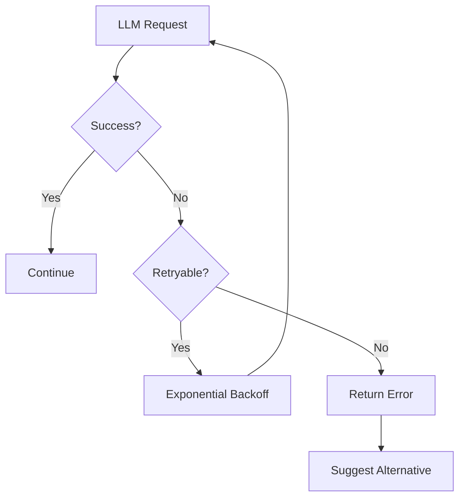

---

## 10. Testing Strategy

### 10.1 Test Pyramid

```
        /\
       /  \     E2E Tests (Full CLI workflows)
      /____\    
     /      \   Integration Tests (Tool + LLM)
    /________\  
   /          \ Unit Tests (Individual components)
  /____________\
```

### 10.2 Testing Approach

| Layer | Tools | Focus |
|-------|-------|-------|
| Unit | `testing`, `testify` | Individual tools, parsers, utilities |
| Integration | `httptest` | LLM providers with mock servers |
| E2E | `exec`, golden files | Full CLI commands |

---

## 11. Future Enhancements

### 11.1 Planned Features

1. **Multi-file editing** - Atomic operations across multiple files
2. **Advanced Git integration** - Auto-commit, branch creation, diff viewing (Basic .gitignore support is Phase 1)
3. **Code indexing** - FAISS/vector search for large codebases
4. **Plugin system** - Custom tool registration
5. **Web interface** - Optional browser-based UI
6. **Collaboration** - Session sharing, comments

### 11.2 Architecture Extensibility

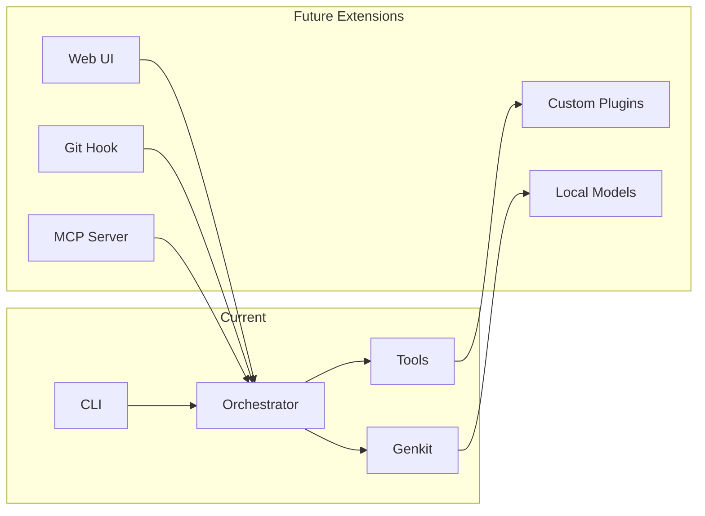

---

## 12. Appendix

### 12.1 System Prompt Template

```
You are a helpful coding assistant. You have access to tools for reading and 
modifying files in the user's project.

Current mode: {{MODE}}
Working directory: {{WORKING_DIR}}

{{MODE_INSTRUCTIONS}}

Available tools:
{{TOOL_DESCRIPTIONS}}

When suggesting changes:
1. Explain what you plan to do
2. Use tools to gather information
3. {{APPLY_INSTRUCTIONS}}
4. Explain what was done
```

### 12.2 Tool Schema Example

```json
{
  "name": "read_file",
  "description": "Read the contents of a file",
  "input_schema": {
    "type": "object",
    "properties": {
      "path": {
        "type": "string",
        "description": "Relative path to the file"
      }
    },
    "required": ["path"]
  }
}
```

---

## 13. Summary

This architecture provides a solid foundation for a coding agent CLI with:

- ✅ Clean separation of concerns (UI, Orchestration, Tools, LLM)
- ✅ **GitAwareness component (Phase 1)** - Respects `.gitignore` to avoid wasting tokens
- ✅ Unified LLM integration via Genkit for Go for extensibility
- ✅ Single dependency for multiple LLM providers
- ✅ Extensible tool system
- ✅ Secure file system access
- ✅ Two-mode operation (Plan/Work)
- ✅ Idiomatic Go patterns
- ✅ Minimal external dependencies
- ✅ Testable design
