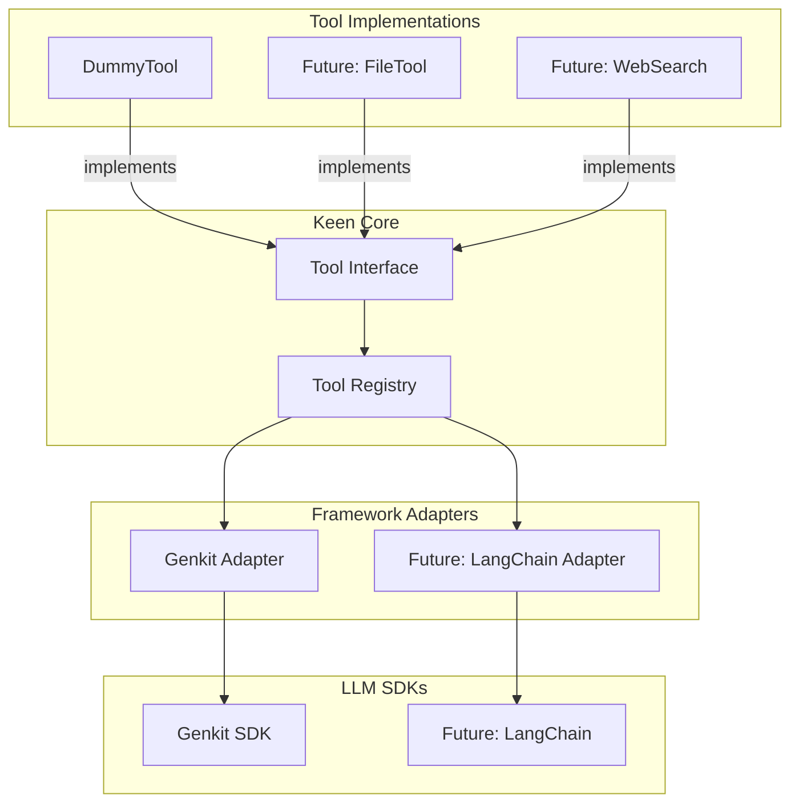
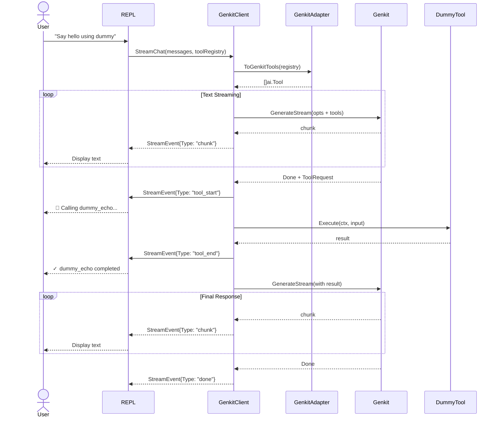

# Phase-3: Tool Calling Architecture

## Overview

Integrate tool calling into Keen Code starting with a dummy tool. The architecture is designed to be **framework-agnostic**, allowing future support for alternative LLM frameworks (e.g., LangChain-go, Ollama) without rewriting tool implementations.

## 1. Architecture Philosophy

Keen Code defines its own minimal tool interface. Framework-specific adapters bridge this interface to the underlying LLM SDK (currently Genkit).



## 2. Tool Interface

Keen Code's framework-agnostic tool contract (`internal/tools/tool.go`):

```go
type Tool interface {
    Name() string
    Description() string
    InputSchema() map[string]any
    Execute(ctx context.Context, input any) (any, error)
}
```

**Design Rationale:**
- No dependencies on Genkit or any LLM framework
- `InputSchema()` returns JSON Schema for LLM consumption
- `Execute()` receives raw JSON-decoded input (framework-agnostic)
- Simple to implement, easy to test in isolation

**Note on `input`:** When called through Genkit, `input` arrives as `map[string]any` (JSON-decoded). Tool implementations should handle type assertion or unmarshal into typed structs.

## 3. Tool Registry

Simple in-memory registry for organizing tools (`internal/tools/tool.go`):

```go
type Registry struct {
    tools map[string]Tool
}

func NewRegistry() *Registry
func (r *Registry) Register(t Tool) error
func (r *Registry) Get(name string) (Tool, bool)
func (r *Registry) All() []Tool
```

## 4. Framework Adapter

The adapter converts Keen tools to Genkit's `ai.ToolDef` (`internal/llm/genkit_tools.go`):

```go
func ToGenkitTool(t tools.Tool) *ai.ToolDef[any, any] {
    return ai.NewTool[any, any](
        t.Name(),
        t.Description(),
        func(ctx *ai.ToolContext, input any) (any, error) {
            return t.Execute(ctx, input)
        },
        ai.WithInputSchema(t.InputSchema()), // Required when using [any, any]
    )
}

func ToGenkitTools(registry *tools.Registry) []ai.ToolRef {
    var genkitTools []ai.ToolRef
    for _, t := range registry.All() {
        genkitTools = append(genkitTools, ToGenkitTool(t))
    }
    return genkitTools
}
```

**Important:** `ai.NewTool` is generic (`NewTool[In, Out]`) and returns `*ai.ToolDef[In, Out]`, not `ai.Tool`. When using `[any, any]` type parameters, `ai.WithInputSchema()` is essential — Genkit cannot infer JSON schema from `any`.

**Future-proofing:** Adding LangChain support only requires a new adapter file without touching tool implementations.

## 5. Stream Event Extensions

Extend `StreamEvent` to include tool lifecycle events (`internal/llm/message.go`):

```go
const (
    StreamEventTypeChunk      StreamEventType = "chunk"
    StreamEventTypeDone       StreamEventType = "done"
    StreamEventTypeError      StreamEventType = "error"
    StreamEventTypeToolStart  StreamEventType = "tool_start"
    StreamEventTypeToolEnd    StreamEventType = "tool_end"
)

type StreamEvent struct {
    Type     StreamEventType
    Content  string
    Error    error
    ToolCall *ToolCall
}

type ToolCall struct {
    Name     string
    Input    map[string]any
    Output   any
    Error    string
    Duration time.Duration  // Idiomatic Go type
}
```

## 6. Conversation History Strategy

The current `Message` struct only supports plain text:

```go
type Message struct {
    Role    Role
    Content string
}
```

**Required for tools:**
- Model messages containing **both text AND tool request parts**
- Tool messages containing **tool response parts** (data, not text)

**Decision for Phase 3:** Use Genkit's `[]*ai.Message` internally for conversation history. This is pragmatic since we're only targeting Genkit now. We can revisit a framework-agnostic message model if/when we add a second LLM framework.

`AppState` will store `[]*ai.Message` and convert to/from Keen's `Message` only at the REPL boundary.

## 7. LLMClient Interface Update

The interface needs to accept tools (`internal/llm/client.go`):

```go
type LLMClient interface {
    StreamChat(ctx context.Context, messages []Message, tools *tools.Registry) (<-chan StreamEvent, error)
}
```

## 8. Dummy Tool

Simple echo tool for testing (`internal/tools/dummy.go`):

```go
type DummyTool struct{}

func (t *DummyTool) Name() string { return "dummy_echo" }
func (t *DummyTool) Description() string { return "Echoes input with timestamp" }
func (t *DummyTool) InputSchema() map[string]any { /* JSON schema */ }
func (t *DummyTool) Execute(ctx context.Context, input any) (any, error) {
    // Echo logic with optional delay
}
```

## 9. Streaming Tool Loop

Genkit supports manual tool handling for visibility. The goroutine iterates through multiple `GenerateStream` calls in a loop.



### Pseudocode for Goroutine Loop

```go
func (c *GenkitClient) StreamChat(ctx, keenMessages, toolRegistry) (<-chan StreamEvent, error) {
    eventCh := make(chan StreamEvent)
    
    go func() {
        defer close(eventCh)
        
        // Convert to Genkit messages and maintain as ai.Message slice
        aiMessages := toGenkitMessages(keenMessages)
        genkitTools := ToGenkitTools(toolRegistry)
        
        for turn := 0; turn < maxTurns; turn++ {
            // Build options for this generation
            opts := []ai.GenerateOption{
                ai.WithModelName(c.model),
                ai.WithMessages(aiMessages...),
                ai.WithTools(genkitTools...),
                ai.WithReturnToolRequests(true), // Manual handling
            }
            
            // Stream this generation
            stream := c.streamImpl(ctx, c.g, opts...)
            var accumulatedContent strings.Builder
            
            for result, err := range stream {
                if err != nil {
                    eventCh <- StreamEvent{Type: StreamEventTypeError, Error: err}
                    return
                }
                
                if result.Done {
                    // Check for tool requests in final response
                    if resp := result.Response; resp != nil && len(resp.ToolRequests()) > 0 {
                        // Continue to tool execution
                        // ... if tools executed, continue outer loop
                    } else {
                        // No tools, conversation complete
                        eventCh <- StreamEvent{Type: StreamEventTypeDone}
                        return
                    }
                    break
                }
                
                // Stream text chunks to UI
                if result.Chunk != nil {
                    text := result.Chunk.Text()
                    if text != "" {
                        accumulatedContent.WriteString(text)
                        eventCh <- StreamEvent{Type: StreamEventTypeChunk, Content: text}
                    }
                }
            }
            
            // Get the model's message (contains ToolRequest parts)
            modelMsg := getModelMessageFromLastResponse()
            aiMessages = append(aiMessages, modelMsg)
            
            // Execute tools and build response message
            toolResponseParts := executeToolsAndStreamEvents(modelMsg, eventCh)
            if len(toolResponseParts) > 0 {
                toolMsg := &ai.Message{
                    Role:    ai.RoleTool,
                    Content: toolResponseParts,
                }
                aiMessages = append(aiMessages, toolMsg)
            }
            
            // Loop continues with updated aiMessages
        }
        
        eventCh <- StreamEvent{Type: StreamEventTypeDone}
    }()
    
    return eventCh, nil
}

func executeToolsAndStreamEvents(modelMsg *ai.Message, eventCh chan<- StreamEvent) []*ai.Part {
    var toolResponseParts []*ai.Part
    
    for _, part := range modelMsg.Content {
        if !part.IsToolRequest() {
            continue
        }
        
        req := part.ToolRequest
        start := time.Now()
        
        // Emit tool_start
        eventCh <- StreamEvent{
            Type: StreamEventTypeToolStart,
            ToolCall: &ToolCall{Name: req.Name, Input: req.Input.(map[string]any)},
        }
        
        // Execute tool
        tool, _ := registry.Get(req.Name)
        output, err := tool.Execute(ctx, req.Input)
        duration := time.Since(start)
        
        // Emit tool_end
        eventCh <- StreamEvent{
            Type: StreamEventTypeToolEnd,
            ToolCall: &ToolCall{
                Name:     req.Name,
                Input:    req.Input.(map[string]any),
                Output:   output,
                Error:    errToString(err),
                Duration: duration,
            },
        }
        
        // Build tool response part for Genkit
        respPart := ai.NewToolResponsePart(&ai.ToolResponse{
            Name:   req.Name,
            Ref:    req.Ref,
            Output: output,
        })
        toolResponseParts = append(toolResponseParts, respPart)
    }
    
    return toolResponseParts
}
```

## 10. UI Visualization

Tool calls render inline with assistant responses:

```
Assistant: I'll use the dummy tool to echo that.

🔧 Calling dummy_echo
   Input: {"message": "hello"}

✓ dummy_echo completed (12ms)
   Output: {"echo": "Echo: hello", ...}

Assistant: The tool responded: "Echo: hello"
```

**Visual conventions:**
- Tool start: Orange italic with hammer emoji
- Tool success: Green with checkmark + timing
- Tool error: Red with X + error message
- Collapsible input/output for readability

## 11. Module Dependencies

```
internal/tools/
├── tool.go          # Tool interface + Registry
└── dummy.go         # Dummy tool (pure Go, no Genkit deps)

internal/llm/
├── message.go       # Stream events + ToolCall
├── client.go        # LLMClient interface
├── genkit.go        # GenkitClient implementation
└── genkit_tools.go  # Genkit adapter

internal/cli/repl/
├── streaming.go     # Handle tool events
└── output.go        # Render tool UI
```

**Dependency rule:** `internal/tools` has **zero** LLM framework dependencies.

## 12. Implementation Phases

### Phase 3.1: Tool Types + Events + Adapter
- `internal/tools/tool.go` — Interface, Registry
- `internal/tools/dummy.go` — Dummy tool
- `internal/llm/message.go` — Extended StreamEvent, ToolCall
- `internal/llm/genkit_tools.go` — Genkit adapter

### Phase 3.2: Client Integration
- Update `LLMClient` interface to accept `ToolRegistry`
- Modify `GenkitClient` to use `[]*ai.Message` internally
- Implement manual tool loop with proper message construction

### Phase 3.3: UI Integration
- Handle tool events in stream handler
- Add tool rendering with styling

## Design Decisions

| Question | Decision | Rationale |
|----------|----------|-----------|
| **Max tool turns** | Default 5 | Matches Genkit's default. Configurable later if needed. |
| **Timeouts** | Per-tool via `context.WithTimeout` | Clean, idiomatic Go. Tool wraps `Execute()` with timeout. |
| **Parallel tools** | Sequential execution | Simpler for phase 3. Parallel optimization for later. |
| **Tool versioning** | Not needed | Over-engineering for dummy tool phase. |
| **History storage** | Use `[]*ai.Message` internally | Pragmatic for single framework. Revisit when adding second. |
