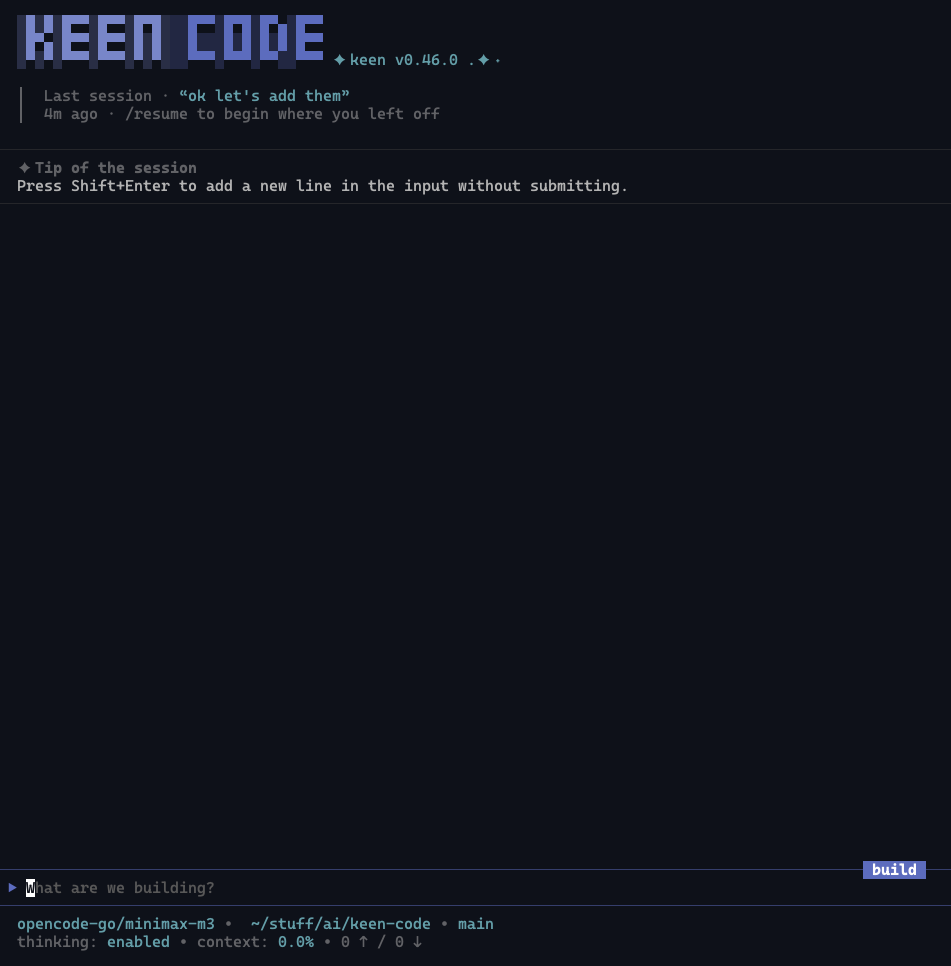
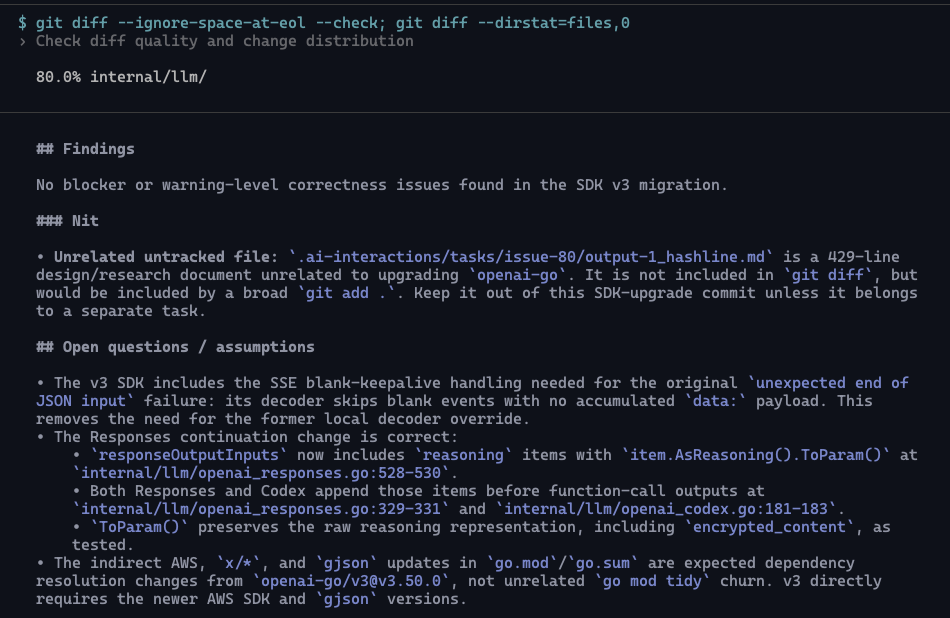
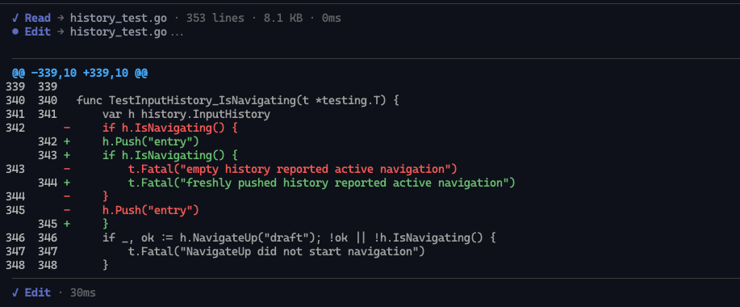
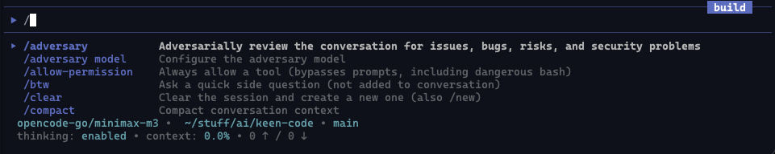
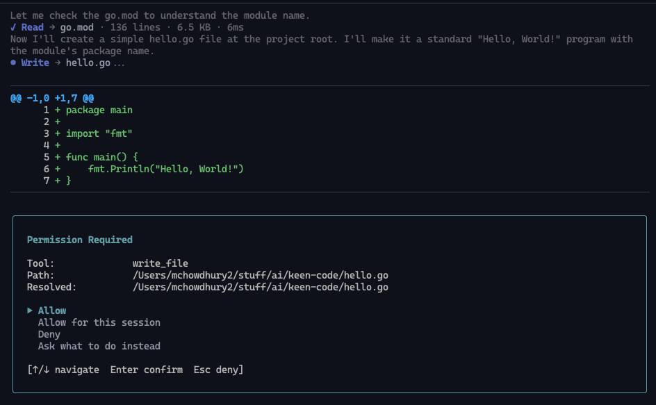

<div align="center">


[](https://github.com/mochow13/keen-code/releases/latest)
[](https://github.com/mochow13/keen-code/actions)
[](https://codecov.io/gh/mochow13/keen-code)
[](https://pkg.go.dev/github.com/mochow13/keen-code)
[](https://go.dev/)
[](https://github.com/mochow13/keen-code/blob/main/LICENSE)

<a href="https://www.producthunt.com/products/keen-code-a-cli-coding-agent?embed=true&utm_source=badge-featured&utm_medium=badge&utm_campaign=badge-keen-code" target="_blank" rel="noopener noreferrer"></a>

</div>

**Keen Code** is a terminal-based AI coding agent like Claude Code or Codex CLI. Written in Go, it is simpler, lighter, minimalistic but useful coding agent for typical software engineering tasks. It supports multiple providers, skills, MCPs, subagents with multi-agent orchestration, and more.

Keen Code is highly opinionated. It avoids features that are not necessarily needed or useful for a regular software engineer. It tries to avoid unnecessary complexity and attempts to keep the agent harness as simple as possible.

From requirements to implementation, Keen Code was engineered using a wide range of coding agents and agentic IDEs. By far, AI coding agents are the most ubiquitous use case in the era of AI agents. One of the goals of the project is to showcase how coding agents can be used to develop coding agents themselves. This is why most prompts and output docs are saved as markdown files in the [`.ai-interactions`](.ai-interactions/) directory. 

Keen Code is also an experiment to play with the *new way of working* where engineers work with AI agents to develop software. In this setting, engineers are sometimes referred to as "orchestrators".

<h3 align="center">
  Born as an experiment, Keen is now a fully functional coding agent designed for real-world software development.
</h3>

<div align="center">
  
</div>

## Table of Contents

- [Features](#features)
- [Screenshots](#screenshots)
- [Development Philosophy](#development-philosophy)
- [Development Cycle Example](#development-cycle-example)
- [Install Keen Code](#install-keen-code)
  - [Install with script](#install-with-script)
  - [Install with npm](#install-with-npm)
- [Run Keen](#run-keen)
- [Supported Providers](#supported-providers)
- [Built-in Tools](#built-in-tools)
- [How Keen Handles Context](#how-keen-handles-context)
- [Further Reading](#further-reading)


## Features

- **Multi-provider** — Anthropic, OpenAI, Codex (via OAuth), Gemini, DeepSeek, Kimi, GLM, MiniMax, OpenCode Go, and Amazon Bedrock. Switch with `/model`. More providers will be added in the future.
- **10 built-in tools** — `read_file`, `write_file`, `edit_file`, `glob`, `grep`, `bash`, `web_fetch`, `ask_user`, `delegate_task`, and `call_mcp_tool`. Core coding tools stay deliberately lean.
- **Hashline editing** — `read_file` prefixes every line with an `N:HASH|` anchor (line number + 3-character FNV-1a hash of the line), and `edit_file` applies a multi-op `ops[]` array validated against one file snapshot, atomically — stale anchors are rejected instead of editing drifted content. Inspired by [pi-hashline-edit](https://pi.dev/packages/pi-hashline-edit).
- **MCP (Model Context Protocol)** — Connect external tool providers from `~/.keen/mcp/configs.json` over streamable HTTP or stdio, with `none`, `api_key`, or browser-based `oauth` auth. Connect and inspect servers with `/mcp`. See [docs/mcp-servers.md](docs/mcp-servers.md).
- **Skill-driven MCP servers** — Each connected MCP server generates an ordinary skill (`mcp:<server>`) with a tool table and JSON schemas, so tool discovery stays prompt-efficient and detailed schemas load on demand. No tool-search-tool needed to discover MCP tools. See [docs/mcp-skills.md](docs/mcp-skills.md).
- **Skills system** — User-defined skills discovered from project and home directories (`.agents/skills`, `.keen/skills`, `.claude/skills`), activated as slash commands and managed with `/skills`. Bundled `commit` and `review` utility skills ship out of the box. See [docs/skills-system.md](docs/skills-system.md).
- **Subagents** — Define focused profiles as markdown files in `.agents/agents/` (project or home) with their own provider, model, thinking effort, and permissions. The main agent delegates up to 10 bounded tasks in parallel with `delegate_task`. See [docs/subagents.md](docs/subagents.md).
- **Persistent memory** — Global (`~/.keen/memory/global/MEMORY.md`) and project (`.keen/MEMORY.md`) markdown files are loaded into the system prompt every session; the agent records to them when you ask it to remember. Manage with `/memory`. See [docs/memory.md](docs/memory.md).
- **Thinking mode** — Extended reasoning for complex tasks. Use `/thinking` to change the thinking effort level for the current model. All models that support thinking can be configured.
- **Session management** — Persistent sessions with resume capability.
- **Context compaction** — Summarize the conversation into a smaller continuation context with `/compact`, or let Keen compact automatically when the context approaches the model's budget. See [docs/compaction.md](docs/compaction.md).
- **Configurable tool history** — Lean cross-turn `TurnMemory` summaries by default; use `/tool-history full` to retain full tool outputs for future turns. More information can be found in [docs/turn-memory.md](docs/turn-memory.md).
- **Adversarial review and side questions** — Run a separately-configured second model as an adversarial critic of the main agent's work with `/adversary`, and ask quick side questions with `/btw` without touching the main conversation. See [docs/cli-usage.md](docs/cli-usage.md).
- **Input queuing** — Prompts and skill activations typed while the agent streams are queued, previewed, and submitted one at a time as turns complete. Clear the queue with `/emptyq`. See [docs/queuing.md](docs/queuing.md).
- **Headless mode** — Run a non-interactive turn with `keen run "<prompt>"`, with `--format json` output, provider/model overrides, `--completion-signal` gating, and `--session` resume. See [docs/cli-usage.md#headless-mode-keen-run](docs/cli-usage.md#headless-mode-keen-run).
- **Permission system** — Filesystem access is guard-checked: working-directory paths pass, sensitive paths prompt for approval, and system or `.gitignore` paths are denied. Always-allow tools with `/allow-permission`. See [docs/permission-system.md](docs/permission-system.md).

## Screenshots

<table>
  <tr>
    <td width="50%" align="center">
      <a href="./assets/full-interface.png">
        
      </a>
      <br><sub>Full interface</sub>
    </td>
    <td width="50%" align="center">
      <a href="./assets/output.png">
        
      </a>
      <br><sub>Command output</sub>
    </td>
  </tr>
  <tr>
    <td width="50%" align="center">
      <a href="./assets/diff.png">
        
      </a>
      <br><sub>Diff review</sub>
    </td>
    <td width="50%" align="center">
      <a href="./assets/commands.png">
        
      </a>
      <br><sub>Interactive commands</sub>
    </td>
  </tr>
  <tr>
    <td colspan="2" align="center">
      <a href="./assets/permission.png">
        
      </a>
      <br><sub>Permission prompt</sub>
    </td>
  </tr>
</table>


## How Keen Handles Context

Keen takes a deliberately lean approach to cross-turn context. Within a single assistant turn the model has full access to its tool calls and results. By default, later model requests receive a bounded `TurnMemory` summary attached to assistant messages: where retained tools ran, their bounded invocation inputs, status, and non-zero bash exit codes—not their raw outputs.

For ideation or work that benefits from revisiting exact earlier results, run `/tool-history full`. Tool outputs from future turns are then retained in the current session's cross-turn model context. Run `/tool-history none` to return to the compact default, or `/tool-history` to inspect the setting. Full history increases prompt size and token cost; it is not persisted when a session is saved.

Subsequent turns therefore receive:

- prior user and assistant messages
- provider-native historical tool-call/result blocks reconstructed from assistant prose and `TurnMemory`
- any pending provider-native state from a turn that failed mid-loop, so the model can resume instead of starting over

The default tradeoff is intentional: smaller context and a better signal-to-noise ratio, at the cost of occasionally re-reading files or re-running searches when older observations are needed again. Read-only facts and external observations are refreshed when needed rather than treated as durable evidence. `/tool-history full` lets you choose continuity over that default for the remainder of the session.

For the full rationale, lifecycle, and comparison with other coding agents, see [`docs/turn-memory.md`](docs/turn-memory.md).

## Development Philosophy

Developing Keen Code is guided by the following philosophy:

- All the code is written by AI agents, not humans
- The project is developed iteratively using spec-task-code-review cycle by a human engineer
- The human engineer has a very strict set of roles:
  - Specifiy and clarify the requirements
  - Review design docs and influence design decisions
  - Review changes made by the agents
    - Changes can also be reviewed by the agents themselves
  - Ensure the quality and correctness of the code
  - Focus on best practices and standards relevant to the programing language (Go in this case)
  - Thoroughly review and test the product after each iteration
  - Continously provide feedback to the agents to improve the product
- Prompts are saved as markdown files in the `.ai-interactions/prompts` directory
  - Almost all of the prompts are stored to showcase how the project evolved from the initial requirements to the current state
  - Prompts are pretty much chronologically ordered which demonstrates the thought process and iterative nature of the development
- All the outputs are saved as markdown files in the `.ai-interactions/outputs` directory
  - These outputs are basically plans, design docs, and breakdowns of the tasks
  - These outputs are the "specs" that the agents later use to implement the tasks

## Development Cycle Example

All features follow a **spec → plan → task → review** cycle. Here's a concrete example — the `read_file` tool from Phase 3:

**Spec** — [`prompts/phase-3/prompt-3_read-file-tool.md`](.ai-interactions/prompts/phase-3/prompt-3_read-file-tool.md)
Requirements defined upfront: ask permission before reading, respect FileGuard path rules, text files only, 1 MB limit, support relative and absolute paths.

**Plan** — [`outputs/phase-3/output-3_read-file-tool.md`](.ai-interactions/outputs/phase-3/output-3_read-file-tool.md)
Design doc produced by the agent: how `Guard.CheckPath` maps to the REPL permission prompt, exact struct contracts, permission flow diagram.

**Task** — [`prompts/phase-3/prompt-2_phase-3-tasks.md`](.ai-interactions/prompts/phase-3/prompt-2_phase-3-tasks.md)
Implementation broken into steps — tool contract, permission bridge, REPL selector, unit tests — each approved before the next began.

**Review** — (inline feedback during implementation)
The LLM was rejecting `.go` files because MIME detection flagged them as binary. Review caught this; switched to character-based text validation. The fix landed in the same iteration.

## Install Keen Code
### Install with script

```bash
curl -fsSL https://raw.githubusercontent.com/mochow13/keen-code/main/scripts/install.sh | bash
```

The same command above updates the CLI to the latest version.

To pin a specific version:

```bash
curl -fsSL https://raw.githubusercontent.com/mochow13/keen-code/main/scripts/install.sh | bash -s -- -v v0.16.1
```

Installs to `/usr/local/bin` if writable, otherwise `$HOME/.local/bin`.

### Install with `npm`

Install the CLI globally:

```bash
npm install -g keen-code
```

Update the global install:

```bash
npm install -g keen-code@latest
# or
npm update -g keen-code
```

`npm update` without `-g` only updates local project dependencies.

Check that the install worked:

```bash
keen --version
which keen
```

You can also run it without a global install:

```bash
npx keen-code --version
```

## Run Keen

Start Keen in your current directory:

```bash
keen
```

## Supported Providers

- Anthropic
- OpenAI
- Codex (ChatGPT OAuth)
- Google AI (Gemini)
- Moonshot AI (Kimi)
- DeepSeek
- Z.ai (GLM)
- MiniMax
- OpenCode Go
- Amazon Bedrock

> Use `/model` to switch providers. The ChatGPT/Codex option opens a browser-based OpenAI sign-in flow and stores OAuth credentials in `~/.keen/auth.json`.

MiniMax uses its Anthropic-compatible API and includes MiniMax M2.7 and M2.5.
OpenCode Go uses an API key and includes GLM, Kimi, DeepSeek, MiMo, MiniMax, and Qwen models.

## Built-in Tools

Keen Code aims to support minimal set of useful tools for coding. Currently, these tools are built in:

- `read_file` — read a UTF-8 text file with `N:HASH|` line anchors
- `glob` — find files by glob patterns
- `grep` — search for text patterns in files
- `write_file` — create or overwrite files
- `edit_file` — hash-anchored multi-op edits (`LINE:HASH` anchors in one `ops` array, applied atomically)
- `bash` — run shell commands
- `web_fetch` — fetch a URL and return the content as text (HTML converted to Markdown)
- `ask_user` — ask the interactive user clarification questions with preselected recommendations
- `delegate_task` — delegate up to 10 bounded tasks to named subagents and run them in parallel
- `call_mcp_tool` — call a tool on a connected MCP (Model Context Protocol) server

## Further Reading

- [TOUR.md](TOUR.md) — the full story of how this project was built
- [CHANGELOG.md](CHANGELOG.md) — release history
- [ROADMAP.md](ROADMAP.md) — what's planned next
- [CONTRIBUTING.md](CONTRIBUTING.md) — how to contribute
- [`docs/`](docs/) — architecture, tools, sessions, skills, and more
